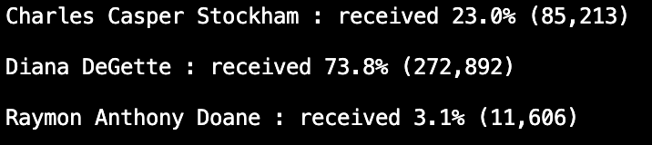
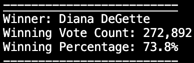

# Election_Analysis
 
## Project Overview
A Colorodo Board of Elections employee has requested an election audit of a recent local Congessional election.

1. Calculate the total number of votes cast.
2. Get a complete lisdt of candidate who received votes.
3. Calculate the total number of votes each candidates received.
4. Calculates the percentage of votes each candidates won.
5. Determine the winner of the election based on popular vote.

## Resources
- Data Source: election_results.csv
- Software: Python 3.8.13, Visual Studio Code, 1.38.1

## Summary
The analysis of the election shows that:
- There were 369,711 votes cast in the election.
- The candidates were:
    - Raymon Anthony Doane
    - Diana DeGette
    - Charles Casper Stockham
- The candidate results were:
    
- The winner of the election was:
    

## Challenge Overview

## Challenge Summary
