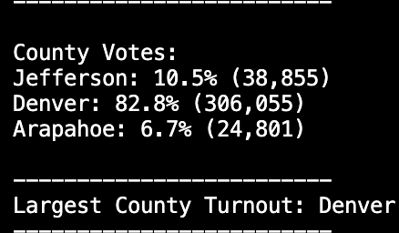

# Election_Analysis
 
## Project Overview
A Colorodo Board of Elections employee has requested an election audit of a recent local Congessional election.

1. Calculate the total number of votes cast.
2. Get a complete lisdt of candidate who received votes.
3. Calculate the total number of votes each candidates received.
4. Calculates the percentage of votes each candidates won.
5. Determine the winner of the election based on popular vote.

## Resources
- Data Source: election_results.csv
- Software: Python 3.8.13, Visual Studio Code, 1.38.1

## Audit Results
The analysis of the election shows that:
- There were 369,711 votes cast in the election.
- The candidates were:
    - Raymon Anthony Doane
    - Diana DeGette
    - Charles Casper Stockham
- The candidate results were:
    
- The winner of the election was:
    
- The election included 3 counties: Jefferson, Denver and Arapahoe
- The largest county turnout was Denver with 82.8% of voter turnout
    

## Election Audit Summary
- It is my recommendation that the Colorado Board of Elections scale the current application to include State and Local elections.
    - A scaled version of the app will  increase the amount of Dependencies. This can get tricky for running python locally(i.e. tabulating all mid-term election reults statewide).
    - Using [Docker](https://www.docker.com/blog/containerized-python-development-part-1/) would reduce dependency conflict across environments.
    - A UI could be implemented to ease use for non-techniucal employees of the Colorado Election Board.
